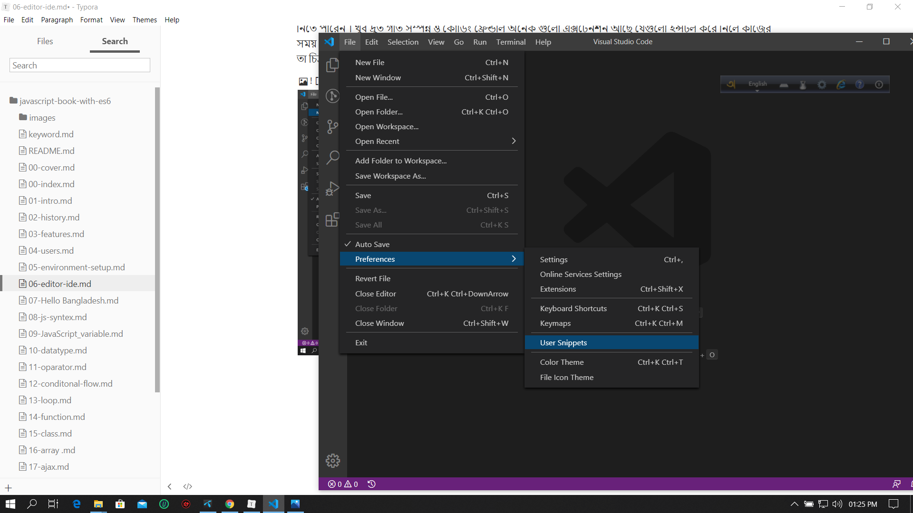
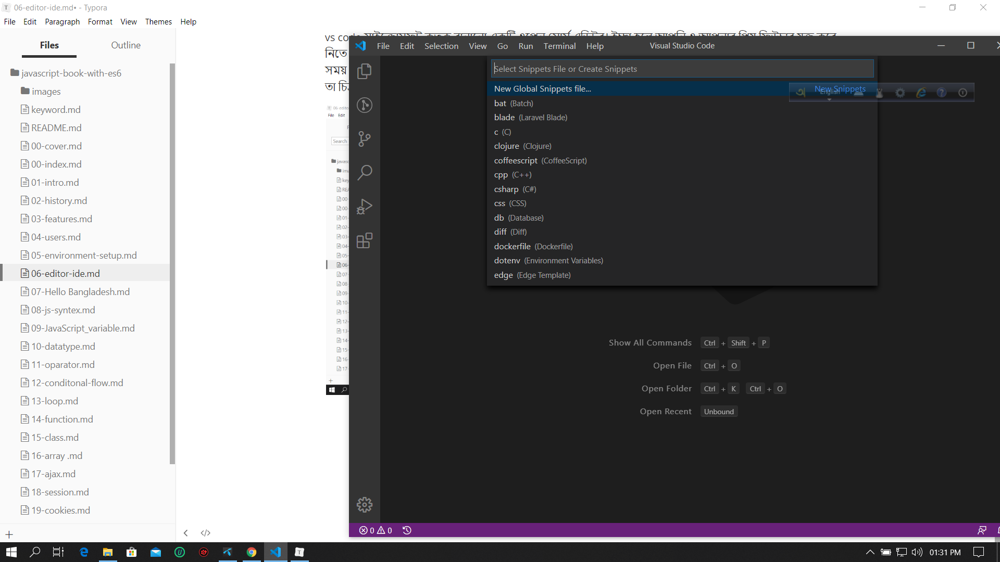
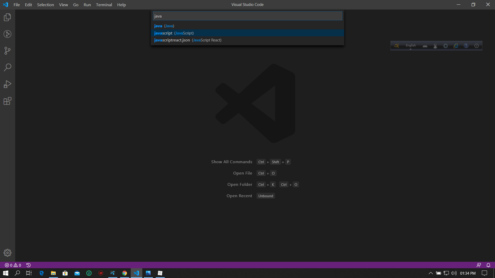

# ভাল এডিটর বা আইডিই

প্রোগ্রামিং করতে গেলে ভাল এডিটর এর কোন জুড়ি নাই । ভাল এডিটর বা আইডিই অনেকটা আপনার ভাল গার্লফ্রেন্ডের মত যে আপনাকে খুব বেশি কষ্ট দিবে না কাজের গতি বাড়িয়ে দিবে নতুন কিছু ভাবার জন্য সময় করে দিবে । আপনার কোডিং লাইফ কে করে দিবে সহজ সরল আর কাজের উপযোগী ।

অনেক অনেক ভাল আইডি আছে তবে আপনার যদি পিসি কনফিগারেশন খুব বেশি ভাল না হয় তাইলে আইডিই না ব্যাবহার করে এডিটর ব্যাবহার করাটাই ভাল ।

আমি এই বইটিতে [Visual Studio Code](https://code.visualstudio.com/) নিয়ে একটু লিখব ।

[Visual Studio Code](https://code.visualstudio.com/) মাইক্রোসফট কতৃক বানানো একটি ওপেন সোর্স এডিটর। ইচ্ছা হলে আপনি ও আপনার প্রিয় ফিউচার যুক্ত করে নিতে পারেন । খুব দ্রুত গতি সম্পন্ন ও কোডিং ফ্রেন্ডলি অনেক গুলো এক্সটেনশন আছে যেগুলো ইন্সটল করে নিলে কাজের সময় ভাল সুবিধা পাওয়া যায়। আপনি চাইলে [Visual Studio Code](https://code.visualstudio.com/)-এ নিজের মতো করে সিনিপেট বানিয়ে নিতেপারেন। যেভাবে বানাবেন তা চিত্র সহ ধাপে ধাপে লিখা হলো।



চিত্রঃ ১

চিত্র ১ এর দিকে লক্ষ্য করেন File -> Preference -> user Sinippets এ ক্লিক করেন। এর পর ২ চিত্র অনুসরণ করুন ।



চিত্র ২

চিত্র ২ এর দিকে লক্ষ্য করলে দেখতে পাবেন একটা ইনপুট বক্স দেখা যাচ্ছে তাতে টাইপ করেন javascript নিচের চিত্র ৩ এর মত



javascript চিহ্নিত করার পর টিক নিচে যা লেখা আছে তার মতো লেখা গুলো দেখাবে ।

```json
{
	// Place your snippets for javascript here. Each snippet is defined under a snippet name and has a prefix, body and 
	// description. The prefix is what is used to trigger the snippet and the body will be expanded and inserted. Possible variables are:
	// $1, $2 for tab stops, $0 for the final cursor position, and ${1:label}, ${2:another} for placeholders. Placeholders with the 
	// same ids are connected.
	// Example:
	// "Print to console": {
	// 	"prefix": "log",
	// 	"body": [
	// 		"console.log('$1');",
	// 		"$2"
	// 	],
	// 	"description": "Log output to console"
	// }
}
```

এরপর সেগুলো কেটে দিয়ে নিচের লেখা গুলো লিখে ফেলুল

```json
{
	
	"Print to console": {
		"prefix": "log",
		"body": [
			"console.log('$1');",
			"$2"
		],
		"description": "Log output to console"
	}
}
```

এখানে "Print to console" এই কী(key) টি মেইন কী(key) এরপর এতে যথাক্রমে "prefix" , "body", "description" তিনটা চাইল্ড কী (key) আছে ।

প্রথম চাইল্ড কী (Key) টা শর্ট ফর্ম বহন করে।

দ্বিতীয় চাইল্ড কী(Key) টা পুরো বডি বহন করে মানে শর্ট ফর্ম লিখলে যে প্রোগ্রামটা অটোমেটিক লেখা হয়ে যাবে সেটা লিখতে হবে।&#x20;

এর পর যে কী(Key) টা আছে সেটা কোডের ডিস্ক্রিপশন বহন করে মানে হলো কোনো বর্ণনা দিতে চাইলে এখানে দেওয়া যাবে।
