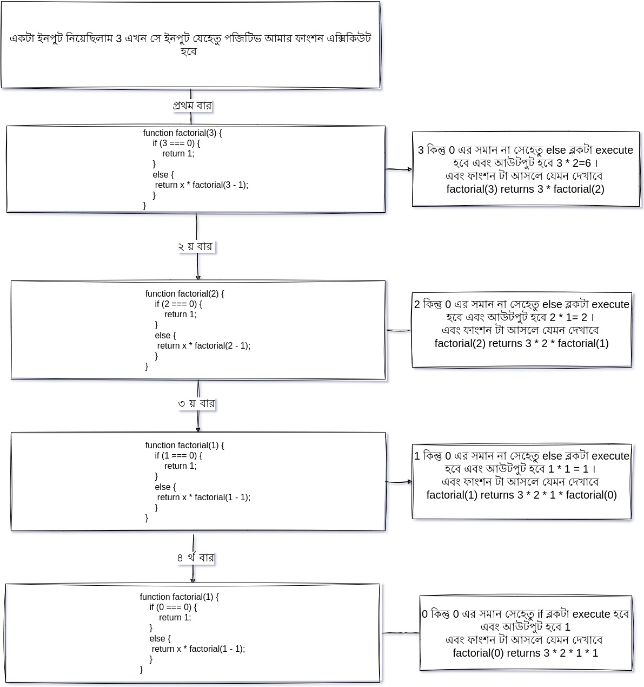

# রিকার্সিভ ফংশন (Recursive Function)

#### রিকার্সিভ**রিকার্সিভ ফাংশনঃ-**

যে ফংশন নিজে নিজেকে কল করে সে ফাংশন কে রিকার্সিভ ফাংশন বলে। বিষয়টা একদম সহজ আমরা আস্তে এর গভীরে যাব। ধীরে কোড বুঝে পরতে হবে এবং কোড গুলো লিখে এক্সিকিউট করতে হবে।&#x20;

**সিনট্যাক্সঃ**&#x20;


```javascript
function recursefn() {
    // function code
    recursefn();
    // function code
}

recursefn();
```



মনে রাখতে হবেঃ-

১।রিকার্সিভ ফাংশন লিখার সময় অবশ্যই একটা এক্সিকিউশন স্টপ শর্ত থাকতে হবে।&#x20;

২। ইনফিনিটি এক্সিকিউশন থেকে বের হতে আপনি if--else statement ব্যাবহার করতে পরেন অথবা  একই ধরনের কোন প্রক্রিয়া অনুসরণ করতে পারেন।&#x20;

৩। বাস্তব জীবনে খুব দরকার না হলে রিকার্সিভ ফাংশন ব্যাবহার না করায় ভাল।&#x20;


আসুন আমরা একটা কোড লিখি যেইটা আমাদের ফ্যাক্টোরিয়াল নাম্বার বের করে দিবে। যেখানে আমরা ইনপুট হিসেবে একটা নাম্বার দিব এবং আউটপুট হিসবে আমরা ঐ ইনপুটের ফ্যাক্টোরিয়াল পাব।&#x20;


```javascript

function factorial(x) {

    // যদি শূন্য হয় আমরা জানি সেক্ষেত্রে ফ্যাক্টোরিয়াল 1 হয় 
    if (x === 0) {
        return 1;
    }

    // যদি ধনাত্মক সংখ্যা হয় সেক্ষত্রে আমারা রিকার্সিভ ফাংশন কে কল করব এবং প্রতিবার ইনপুট সংখ্যা থেকে ১ বিয়োগ করে দিব। 
    else {
        return x * factorial(x - 1);
    }
}
// একটা সংখ্যা ইনপুট হিসবে নিলাম। 
const num = 3;

// যদি ইনপুট নাম্বার পজিটিভ বা ধনাত্মক হয় তাহলে আমি ফাংশন কল করব এবং যে আউটপুট পাবো সেইটা একটা ভেরিয়েবল এর মধ্যে রেখে দিব।
if (num > 0) {
    let result = factorial(num);
    console.log(` ইনপুট নাম্বার ${num} এর ফ্যাক্টোরিয়াল সংখ্যা {  result }`)
}
```



#### এখন একটু জেনে নেই এইটা আসলে কিভাবে এক্সকিউট হচ্ছে?&#x20;


#### কখন আপনি রিকার্সিভ ফাংশন ব্যাবহার করবেন  ?&#x20;

<figure><figcaption><p> recursive function execution flow</p></figcaption></figure>

১। যখন আপনি কোন একটা ফাংশনকে ছোট ছোট সাব প্রব্লেমে ভাগ করতে চান। এইটাকে divide-and-conquer approach নামেও  বলা হয়ে থাকে।&#x20;

২। আপনি যখন কোন গ্রাফের ট্রাভার্স করতে চাইবেন।&#x20;

৩। আপনি যখন কোন পর্যায়ক্রমিক ভ্যালু চাইবেন যেমনঃ- **ফিবোনাক্কি**&#x20;

#### কখন আপনি রিকার্সিভ ফাংশন ব্যাবহার করবেন না ?&#x20;

১। যখন আপনি মনে করবেন যে প্রভলেমটা লুপ দিয়ে করা পসিবল।&#x20;

২। যদি প্রভলেমটা অনেক বেশি জটিল এবং বড় হয়ে যায় ।

৩। যদি আপনি মনে করেন আপনার কোডে পারফর্মেন্স এর সমস্যা হচ্ছে। কারণ তুলনা মূলক ভাবে রিকার্সিভ ফাংশন ধীরগতির।&#x20;
