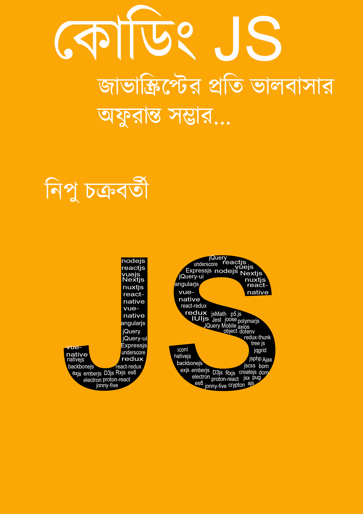

# বইয়ের কভার(Book Cover)

#### সূচিপত্র

1\. [ভুমিকা](01-intro.md)\
2\. [জাভাস্ক্রিপ্টের নির্মাতা ও ইতিহাস](02-history.md)।\
3\. [জাভাস্কিপ্টের আওতা](03-features.md)।\
4\. [কাদের জন্য জাভাস্ক্রিপ্ট?](04-users.md)\
5\. [এনভায়রনমেন্ট সেটআপ ।](environment-setup.md)\
6\. [ভাল এডিটর বা আইডিই।](06-editor-ide.md)\
7\. [প্রথম প্রোগ্রাম =হ্যালো বাংলাদেশ ।](07-hello%20Bangladesh.md)\
8\. [সিনট্যাক্স নিয়ে যত কথা।](08-js-syntex.md)\
9\. [ভেরি + এবল =ভেরিয়্যাবল কি?](09-JavaScript\_variable.md)\
10\. [ডেটা টাইপ](10-datatype/)\
11\. [অপারেটর](11-oparator.md)\
12\. [কন্ডিশনাল কন্ট্রোল ফ্লো](12-conditional-flow.md)\
13\. [লুপ এবং ইটারেশন](13-loop/)\
14\. [ফাংশন](14-function/)\
15\. [ক্লাস](15-class/)\
16\. [অ্যারে](16-array.md)\
17\. [এজ্যাক্স](js-dom.md)\
18\. [সেশন](web-storeage/)\
19\. [কুকিস](web-storeage/19-cookies.md)\
20\. [ডোম](js-dom.md)\
21\. [জাভাস্ক্রিপ্ট স্টাইল](21-js-style.md)\
22\. [এপি আই কি কেন ?](22-what-is-api.md)\
23\. [ফ্রেম ওয়ার্ক লাইব্রেরী নিয়ে খোশ গল্প](23-framework-library-gossip.md)\
