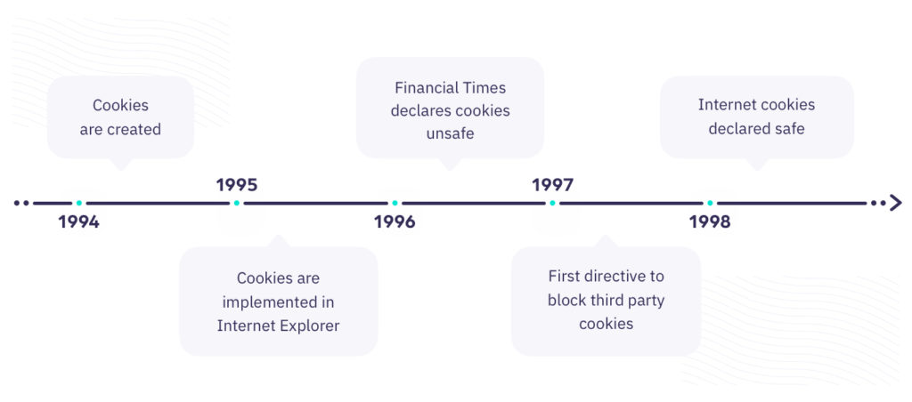

# Async এবং await (Async & Await)

Async শব্দের অর্থ হলো অসমনিয়ত। মানে হলো আপনি এমন কোন কাজ করতে চাইছেন যেইটা আসলে একটার পর একটা হবে না বা সিরিয়ালি হবে না। তাহলে কেমন করে হবে?&#x20;

তাহলে বিষয়টা গল্প করে বলি, ধরুন আপনি কোন একটা কুরিয়ার সার্ভিস কোম্পানি এর মালিক। ধরে নিলাম আপনার কোম্পানির নাম হচ্ছে **আত্মবিশ্বাস** এখন আপনি অনেকের কাজ থেকে পন্য নেন এবং তাদের গন্তব্য স্থলে পৌছে দেন। এই যে কাজ **আত্মবিশ্বাস** কোম্পানি করে সেইটা কিন্তু সিরিয়ালি হচ্ছে না। প্রশ্ন হচ্ছে কেন? ধরুন **দিলদার** নামে একজন ব্যাক্তি ১১ তারিখ সকাল ১০ঃ০০ টায় পন্য কুরিয়ার সার্ভিসে জমা দিয়েছে যার গন্তব্য স্থল হচ্ছে **চট্টগ্রামের কাপ্তাই** এলাকা আর **বাপ্পারাজ** তার বউয়ের জন্য শাড়ি পাঠিয়েছে যেইটা **রাঙ্গামাটি এলাকা** জমা দেওয়ার সময় ছিল ১১ তারিখ সকাল ৯ঃ০০ টা আর **জসিম সাহেব** বউয়ের জন্য সেলাই মেশিন পাঠিয়েছেন যেইটা চট্টগ্রামের **বদ্দার হাট** এলাকা জমা দেওয়ার সময় ছিল একই তারিখে সকাল ১২ঃ০০টা । এখন আপনার **আত্মবিশ্বাস** কোম্পানির লোকেশন  হচ্ছে ঢাকা গুলশান-১ । আপনি যখন পন্য নিয়ে রওনা দিলেন আপনি এখন কার টা ডেলিভারি দিবেন? অবস্যই যার লোকেশন আপনার যাওয়ার সময় সামনে পাবেন বা কাছে হবে। ধরে নিলাম আপনার অফিস থেকে যাদের ডেলিভারি দিবেন তাদের বাসার দূরত্ব হচ্ছেঃ-

<table data-full-width="false"><thead><tr><th>আপানার কোম্পানি লোকেশন</th><th>গন্তব্য দূরত্ব</th><th>গন্তব্য এর নাম</th></tr></thead><tbody><tr><td><strong>আত্মবিশ্বাস গুলশান-১</strong></td><td>৩০১ কিঃ মিঃ </td><td><strong>কাপ্তাই(দিলদার)</strong></td></tr><tr><td><strong>আত্মবিশ্বাস গুলশান-১</strong></td><td>৩০৬ কিঃ মিঃ </td><td><strong>রাঙ্গামাটি(বাপ্পারাজ)</strong></td></tr><tr><td><strong>আত্মবিশ্বাস গুলশান-১</strong></td><td>২৫২ কিঃ মিঃ</td><td><strong>বদ্দার হাট(জসিম)</strong></td></tr></tbody></table>

এখন আপনি আপনি আশা করি বুঝে নিয়েছেন যে কার টা আগে ডেলিভারি হবে। তো উত্তর হচ্ছে জসিম। কেন? কারণ জসিমের বসার দূরত্ব কম তাই জসিম আগে পাবেন। তারপর দিলদার সাহেবের তারপর বাপ্পারাজ । আর এই যে পুরো বিষয় টা এইটায় হচ্ছে Async বা Asynchronous ।

এবার আসি আসল কথায় আমারা এর আগেই জেনেছি প্রমিস নামে এমন একটা জিনিস আগে থেকেই আছে তাহলে আমারা Async লিখতে যাচ্ছি কেন?

উত্তর হচ্ছে আমরা আসলে প্রমিসের যে সিন্ট্যাক্স সেটাকে ছোট করে লেখার জন্য এমন টা করেছি বা আমাদের কোন ফাংশনে যাতে আমরা খুব সহজে প্রমিস বিষয় টা যুক্ত করতে পারি তার জন্য এমন টা করছি।&#x20;

তাহলে এবার একটা উদাহরণ দেখে নেই কিভাবে লিখে Async ফাংশন&#x20;


```javascript
async function regularFunction() {
 //statement
}

```




```javascript
const arrowAsyncFunction = async () => {
  //statement
};

```




```javascript
class MyClass {
  async classAsyncMethod() {
    //statement
  }
}

```


এখন ফাংশন তো লিখে ফেললেন সেইটা কল করবেন কিভাবে তাও একটা ব্যাপার আছে। Async কল করার দুইটা উপায় আছে একটা হচ্ছে প্রমিসের মতো করে মেথড চেইনিং এবং আরেকটা হচ্ছে await চলুন দেখে নেই সেগুলো কিভাবে লিখে।


```javascript
//with regular function
async function sum() {
  return 2+3
}

//With Promise syntex
sum.then(function(response){
  return response;
})

//with await syntex
const result = await sum()

// with arrow function
const sum = async ()=>{
 return 2+2;
}

//Promise syntex
sum.then(res=>console.log(res))

// await syntext 
const result = await sum()
console.log(result)


// with class member functions
class Mathmatic{
   async sum(){
     return 3+3;
   }
}

const math = Mathmatic()

//Promise Syntex
math.sum().then(res=>console.log(res))

//await syntex
const result = await math.sum()
console.log(result)
```


এখন আসুন await নামে যে বিষয় টা আছে সেইটার একটু  গভীরে যায়। আসলে await বিষয় টা হচ্ছে, আমরা যে বিষয়টা **Asynchronous** ভাবে করতে চাইছিলাম সেইটা এখন **synchronous** ভাবে করতে চাইছি মানে আমি আবার এই কাজ টা জাভাস্ক্রিপ্টের ডিফল্ট ওয়েতে করতে চাইছি । আশা করি বুঝতে পেরেছেন। তাছাড়া আমরা যে প্রমিসে then চেইনিং মেথড এর ব্যাবহার করতাম তার কাজটাও কমিয়ে দিচ্ছে। await ব্যবহার করলে তখন আর এই চেইনিং মেথড এর দরকার পরে না তবে চেইনিং মেথড এর ইউস কেইস কিন্তু অন্য ব্যাপার কে বুজায়, বলে রাখলাম।&#x20;


#### সিকুয়েন্সিয়াল প্রসেসঃ&#x20;

<figure><figcaption><p>সিকুয়েন্সিয়াল প্রসেস</p></figcaption></figure>

উপরের চিত্র দেখে বুঝে যাবেন যে আমরা এইখানে একটা কাজের পর আরেকটা কাজ করছি এর এই বিষয়টা হচ্ছে সিকুয়েন্সিয়াল প্রসেস । যা জাভাস্ক্রিপ্ট ইন্টারপ্রেটারের মধ্যমে **Synchronous** ভাবে করে।&#x20;

**কনকারেন্সিঃ**&#x20;

কেমন হতো যদি একই সময়কে ভাগ করে নিতে পারতেন মানে একই সময় আপনি একের অধিক কাজ করে ফেলছেন। যেমন ধরুন আপনি মুভি দেখতে দেখতে পপকর্ন খাচ্ছেন আবার সাথে সাথে ফেইসবুকে নিউজ ফিডে আপনার বন্ধু বউয়ের সাথে কক্সবাজার গিয়ে ভিডিও দিয়েছে সেইটা দেখছেন তাই দেখে একই সাথে মন খারাপ করছেন। একটু ভেবে দেখুন তো কাজ গুলো কিন্তু আপনি একটা সময় কে ভাগ করে করে ফেলছেন মানে আপনি কোন একক সময়ে ভিন্ন ভিন্ন কাজ করে ফেলছেন যেইটা আপনি সিকুয়েন্সিয়েলি করতে গেলে টাইম বেশি লাগত।&#x20;

আশা করি বুঝে গেছেন কনকারেন্সি কি? কনকারেন্সি হচ্ছে কোন একক সময় ভিন্ন ভিন্ন কাজ কে একসাথে করার একটা উপায়।


```javascript
function routine(task, time) {
  return new Promise((resolve, reject) => {
    setTimeout(() => {
      resolve(task);
    }, 1000 * time); // 1 sec = 1000 ms
  });
}

async function main() {
 
const task_list = ['Watching movie', 'Eating popcorn', 'Using Facebook to watch videos of friends and his wife's Cox's Bazar tour', 'Getting upset'];
  const times_for_task = [10, 30, 30, 30]
  const t0 = performance.now();
  const task_completed_log = await Promise.all(task_list.map((task, index)=> {
    return routine(task,times_for_task[index])
  }));
  console.log("task completed",task_completed_log)
  const t1 = performance.now();
  console.log(`Call to routine took ${(t1 - t0)/1000} sec. expected time was ${((10*1000)+(30*1000)+(30*1000)+(30*1000))/1000} sec`);
}
```


**output**

```sh
task completed [
  'Watching movie',
  'Eating popcorn',
  'Using Facebook to watch videos of friends and his wife's Cox's Bazar tour',
  'Getting upset'
]
Call to routine took 30.023713645003735 sec. expected time was 100 sec
```

উপরের কোডটা লক্ষ্য করলে দেখবেন আমি আমি একসাথে অনেকগুলো টাস্ক কে এক্সিকিউশন প্রসেস এর মধ্য দিয়েছি। যেগুলো আসলে **Asynchronous** টাস্ক সে একটা টাস্কের জন্য এইখানে আমি টাইম বলে দিয়েছি যে একটা টাস্ক কয় মিনিট ধরে এক্সিকিউশন প্রক্রিয়ার মধ্য দিয়ে যাবে। টাইম অনুযায়ী আমার টাস্কটা গুলো কমপ্লিট হওয়ার কথা ছিল ১০০ সেঃ কিন্তু হায়! হায় ! একি হলো? তার আগেই আউটপুট পেয়ে গেলাম তাহলে আমি কি আসলে ভুল কোড লিখলাম ? উত্তর হচ্ছে না। আসুন বিষয়টা বুঝি। এইখানে আসলে যেইটা হয়েছে আমি যে টাইম টা দিয়েছি সেইটা কে সে অন্যভাবে এক্সিকিশন প্রসেসে নিয়ে গেছে।

সে এক সাথে সব টাস্কগুলো গুলোকে প্রসেসে নিয়ে গেছে&#x20;

আসুন চিত্র এর মধ্যমে দেখি।

<figure><figcaption><p>concurrency</p></figcaption></figure>

#### প্যরালাললিজমঃ

<figure><figcaption><p>প্যারালাললিজম</p></figcaption></figure>


```javascript
// Create a worker for brushing
const brushWorker = new Worker('brush-worker.js');
brushWorker.postMessage('Start brushing!');

// Create a worker for cleaning the bedroom
const cleanWorker = new Worker('clean-worker.js');
cleanWorker.postMessage('Start cleaning the bedroom!');

// Create a worker for cooking breakfast
const cookWorker = new Worker('cook-worker.js');
cookWorker.postMessage('Start cooking breakfast!');

// Create a worker for watching the news on TV
const watchTvWorker = new Worker('watch-tv-worker.js');
watchTvWorker.postMessage('Start watching TV!');

// Listen for messages from workers
brushWorker.onmessage = (event) => {
  console.log(`You: ${event.data}`);
};

cleanWorker.onmessage = (event) => {
  console.log(`Your wife: ${event.data}`);
};

cookWorker.onmessage = (event) => {
  console.log(`Your mom: ${event.data}`);
};

watchTvWorker.onmessage = (event) => {
  console.log(`Your father: ${event.data}`);
};

```




```javascript
self.onmessage = (event) => {
  console.log(`Brushing: ${event.data}`);
  self.postMessage('Finished brushing!');
};

```




```javascript
self.onmessage = (event) => {
  console.log(`Cleaning the bedroom: ${event.data}`);
  self.postMessage('Finished cleaning the bedroom!');
};

```




```
self.onmessage = (event) => {
  console.log(`Cooking breakfast: ${event.data}`);
  self.postMessage('Finished cooking breakfast!');
};

```




```javascript
self.onmessage = (event) => {
  console.log(`Watching TV: ${event.data}`);
  self.postMessage('Finished watching TV!');
};

```

