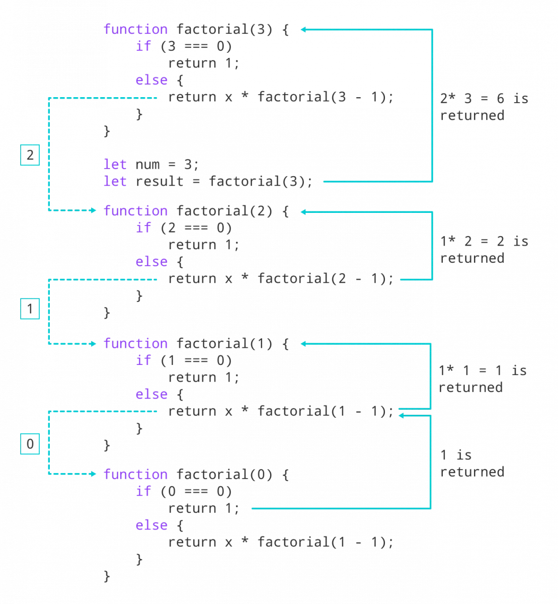

# ইনহেরিটেন্স (Inhertance)

গল্প দিয়ে শুরু করি কিভাবে কি! ১৯৯৬ সালে স্যার _**চার্লস অ্যান্টনি রিচার্ড হোয়ার**_ **Charles Antony Richard Hoare (Tony Hoare or C. A. R. Hoare)** নামে এক ব্রিটিস কম্পিউটার প্রকৌশলী রেকর্ডের উপর ভিত্তি করে করে কিছু কন্সেপ্ট কে একত্রীকরণ উপস্থাপন করে আর সে কনসেপ্ট কে ভিত্তি করে ১৯৬৭ সালে ওলে-জোহান ডাহল এবং ক্রিস্টেন নাইগার্ড একটি নকশা উপস্থাপন করেছিলেন যা বিভিন্ন ক্লাসের ভিতরের বিষয় বস্তু গুলোকে একটি সুপার ক্লাসে নিয়ে অন্য আরেকটা ক্লাসে ব্যাবহারের সুবিধা দিবে। এবং পরে তা সিমুলা-৬৭ এর সাথে যুক্ত করে বাজারে ছাড়ে পরে অন্যান্য প্রোগ্রামিং ল্যাঙ্গুয়েজ এই বিষয়টাকে তাদের বৈশিষ্ট্য হিসেবে যুক্ত করে নেয়।&#x20;

source : [https://en.wikipedia.org/wiki/Inheritance\_(object-oriented\_programming)](https://en.wikipedia.org/wiki/Inheritance\_\(object-oriented\_programming\))

ইনহেরিটেন্স এর মানে হচ্ছে উত্তরাধিকার সূত্রে পাওয়া। যদি বলি পুত্র/কন্যা তার বাবা/মায়ের কিছু বৈশিষ্ট্য পেয়ে থাকে যেইটা উত্তরাধিকার সূত্রেই পেয়ে থাকে সেইটাই ইনহেরিটেন্স । আরো যদি সরল ভাবে বলি একটা বস্তু/জিনিস/একটা অবজেক্ট যখন অন্য একটা অবজেক্ট বা অন্য একটা বস্তু বা অন্য একটা জিনিস থেকে কিছু বৈশিষ্ট্য ধার করে বা নিজের মধ্যে নিয়ে নেয় সেইটায় ইনহেরিটেন্স।

ইনহেরিটেন্স কত প্রকার ও কী কী?

**১। সিঙ্গেল ইনহেরিটেন্স**

<figure><figcaption><p>image source: <a href="https://upload.wikimedia.org/wikipedia/en/thumb/3/32/Single_Inheritance.jpg/170px-Single_Inheritance.jpg">https://upload.wikimedia.org/wikipedia/en/thumb/3/32/Single_Inheritance.jpg/170px-Single_Inheritance.jpg</a></p></figcaption></figure>

এখানে আপনি গাড়িকে চিন্তা করতে পারেন যেখানে আসলে একটা গাড়ি অনেক টাইপের বা অনেক ধরনের হতে পারে কিন্তু তাদের বৈশিষ্ট্য গুলো কিন্তু সেইম অনেক ক্ষেত্রে সে কমন বৈশিষ্ট্য গুলোর উপর ভিত্তি করে আপনি জানাতে আপনি Vehicle নামে একটা ক্লাস বানালেন যেখানে আপনি আসলে কিছু কমন মেথড রাখবেন যেমন গাড়ির মডেল , কালার, গাড়ির চাকা ইত্যাদি ইত্যাদি। পরে আপনি সেই ক্লাস টা কে Car, Bike, Truck ধরনের ক্লাসের জন্য ব্যবহার করতে পারেন।&#x20;

**২। মাল্টিপল ইনহেরিটেন্স**

<figure><figcaption><p>image source: <a href="https://upload.wikimedia.org/wikipedia/en/thumb/6/69/Multiple_Inheritance.jpg/170px-Multiple_Inheritance.jpg">https://upload.wikimedia.org/wikipedia/en/thumb/6/69/Multiple_Inheritance.jpg/170px-Multiple_Inheritance.jpg</a></p></figcaption></figure>

ধরুন আপনার কাছে কেউ এসে বলল ভাই আমার অফিস সেটাপ করে দিতে হবে এবং আমি যাতে সব জায়গা থেকে আমার অফিসের সব কিছু দেখতে পারি এবং কন্ট্রো করতে পারি যেমন সিসি ক্যামরা , ওয়াই-ফাই , মনিটর সব কিছু । এই ধরনের সমস্যা এর ক্ষেত্রে যেহেতু সব কিছুর আলাদা আলাদা বৈশিষ্ট্য রয়েছে সেহেতু আমার প্যারেন্ট ক্লাসের ও ভিন্নতা আস্তে পারে কিন্ত আমরা যেহেতু এক জায়গা থেকে কন্ট্রো করতে চাইছি সে জন্য দরকার মাল্টিপল ইনহেরিটেন্স।  আশা করি বুঝতে পেরেছেন।&#x20;

**৩। মাল্টি লেবেল ইনহেরিটেন্স**

<figure><figcaption><p>image sourcce : <a href="https://upload.wikimedia.org/wikipedia/en/thumb/0/0e/Multilevel_Inheritance.jpg/170px-Multilevel_Inheritance.jpg">https://upload.wikimedia.org/wikipedia/en/thumb/0/0e/Multilevel_Inheritance.jpg/170px-Multilevel_Inheritance.jpg</a></p></figcaption></figure>

আপনি ঝখন কোন কিছু ক্লাসিফিকেশন করতে চাইছেন বা করতে চাচ্ছেন তখন কিন্তু এমন ইনহেরিটেন্স প্রয়োজন পরে। যেমন ধরুন আপনি প্রানীর শ্রেণী বিভেদ করতে চাইছেন&#x20;

১। যারা উড়তে পারে

২। যাদের পা আছে&#x20;

৩। যাদের পা নেই

৪। স্তন্য পায়ী কিনা

বা আরো সুন্দর করে বলা যায় আপনি আপনার বাবা এবং দাদার কিছু গুন পেয়েছেন হয়ত চোখ আপনার বাবার মতো চেহেরা আপনার দাদার মতো ।&#x20;

<figure><figcaption><p>ইনহেরিটেন্স </p></figcaption></figure>

ছবি রেফারেন্সঃ [https://seleniumautomationtester.wordpress.com/2017/03/09/inheritance-in-java/](https://seleniumautomationtester.wordpress.com/2017/03/09/inheritance-in-java/)

নিচে একটা উদাহরন দিয়ে দেখানো হলো।

```javascript
class Country {
  constructor(name) {
    this.countryName = name;
  }
  getCountryName() {
    return 'Country Name: ' + this.countryName;
  }
}

class Division extends Country {
  constructor(country,division) {
    super(country);
    this.division = division;
  }
  show() {
    return 'Country: ' + this.getCountryName() + "division: " + this.division;
  }
}

let myDivision = new Division("Bangladesh", "Chittagong");
console.log(myDivision.show());
```

উপরের উদাহরণ টা যদি লক্ষ্য করেন তাহলে দেখতেই পাচ্ছেন **Country,Division** নামে দুইটি ক্লাস লিখেছি এবং একটা আরেকটা কে <mark style="color:orange;">extends</mark> keyword দিয়ে  **Division** ক্লাসে আমি **Country** ক্লাসটিকে ইনহেরিট করেছি এবং তারপরে কন্সট্রাটর ক্লাসে super ফাংশন্টাকে কল করেছি এবং **Country** ক্লাসের কন্সটাক্টর ফাংশন এর দিকে লক্ষ্য করলে দেখবেন সেখানে একটা প্যারামিটার নিচ্ছে আর সেইটা getCountryName নামের ফাংশন টি দিয়ে দেখানো হচ্ছে তাই আমি যখন super ফাংশন টা কে কল করছি তখন এর মাঝে country প্যারামিটার টা পাঠিয়ে দিচ্ছি।&#x20;
